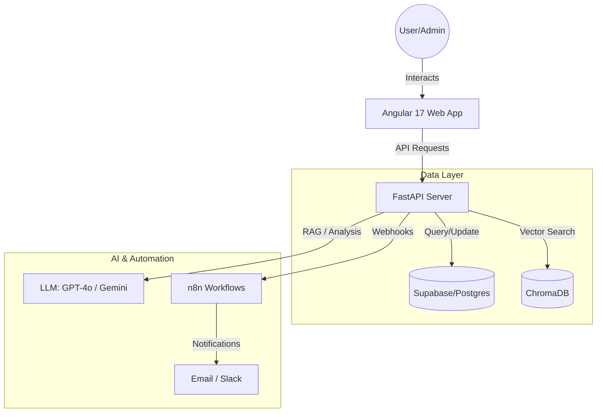

# 🏛️ UniGov: Strategic University Governance OS

[](https://fastapi.tiangolo.com/)
[](https://angular.io/)
[](https://supabase.com/)
[](https://www.trychroma.com/)

**UniGov** is a next-generation Strategic Operating System designed to empower university networks with real-time intelligence, automated governance, and AI-driven decision-making. 

---

## 📸 Overview
UniGov transforms raw institutional data into actionable strategy. Whether managing 30+ institutions or a single campus, UniGov provides a "Single Source of Truth" for KPIs, alerts, and strategic roadmaps.

### 🧩 System Architecture



---

## ✨ Core Pillars

### 1. 🧠 AI-Driven Intelligence (The Brain)
*   **Context-Aware Assistant**: Not just a chatbot, but a Strategic Assistant that "reads" your institutional policies (via RAG) and "sees" your live metrics.
*   **Anomaly Engine**: Uses statistical analysis to flag deviations in student success, finance, or ESG metrics before they become crises.
*   **What-If Simulator**: A predictive sandbox where leaders can simulate the impact of budget reallocations on academic outcomes.

### 2. 📊 High-Fidelity Observability
*   **Global Command Center**: A bird's-eye view of all 30+ institutions in the network.
*   **Interactive KPI Manager**: Track academic success, financial execution, HR turnover, and ESG goals with beautiful, interactive visualizations.
*   **Alerts Center**: Severity-based alerting system that keeps decision-makers focused on what matters most.

### 3. 📄 Smart Governance & Reporting
*   **Intelligent Ingestion**: Upload institutional PDFs or CSVs; the system extracts relevant data points and indexes policy text for the AI Assistant.
*   **Automated Strategic Reports**: Generate comprehensive monthly or annual reports with one click, complete with AI-generated "Executive Summaries."

---

## 👥 User Personas

| Role | Capabilities |
| :--- | :--- |
| **Super Admin** | Full network control, user management, and global policy setting. |
| **Institution Admin** | Management of a specific campus, detailed KPI tracking, and local alerts. |
| **Strategic Agent** | Data analysis, report generation, and AI-assisted policy review. |

---

## 🛠️ API Documentation (v1)

| Endpoint | Method | Description |
| :--- | :--- | :--- |
| `/api/v1/dashboard/global` | `GET` | Fetch top-level metrics for the entire network. |
| `/api/v1/ai/prompt` | `POST` | Interact with the UniGov Strategic Assistant. |
| `/api/v1/analytics/what-if` | `POST` | Run correlation-based simulations between KPIs. |
| `/api/v1/ingestion/upload` | `POST` | Upload and process institutional data files. |
| `/api/v1/alerts/active` | `GET` | List all unacknowledged critical alerts. |

---

## 🚀 Quick Start

### Backend (The Core)
1. **Setup Env**: Copy `.env.example` to `.env` and fill in your Supabase and LLM keys.
2. **Install**: `pip install -r requirements.txt`
3. **Initialize**: 
   ```bash
   python seed_data.py   # Populates 12 months of historical data
   python create_admin.py # Creates your superadmin account
   ```
4. **Launch**: `uvicorn app.main:app --reload`

### Frontend (The UI)
1. **Install**: `npm install`
2. **Launch**: `npm start`
3. **Login**: Use `admin@unigov.tn` with the password set in `create_admin.py`.

---

## 🔮 Future Roadmap
- [ ] **Mobile Executive Dashboard**: iOS/Android app for real-time alert notifications.
- [ ] **Predictive Maintenance**: Infrastructure monitoring using IoT sensor data.
- [ ] **Blockchain Credentials**: Immutable storage for academic certificates and degrees.
- [ ] **Multi-Language Support**: Full localization for international university networks.

---

## 🤝 Contribution
Developed with ❤️ for the **University Governance Hackathon**. 
**UniGov Team 2025**
